# 📊 HR Analytics & Employee Attrition Dashboard

End-to-end Data Analytics project that transforms raw employee data into actionable HR insights using **SQL**, **Python**, and **Power BI**.

---

## 📌 Project Overview

This project analyzes 1,200 employee records to answer key business questions related to attrition rate, department-wise turnover, job satisfaction, overtime impact, tenure, salary, and other factors associated with employees leaving the company.

The complete pipeline follows a real-world data analyst workflow:

**SQL → Python (Pandas + Matplotlib) → Power BI Dashboard**

---

## 🛠️ Tools & Technologies

- **SQL (MySQL)** – Data extraction and business analysis
- **Python** – Data cleaning, exploratory data analysis (EDA), and visualization
- **Pandas & NumPy** – Data manipulation
- **Matplotlib & Seaborn** – Charts and visual insights
- **Power BI** – Interactive HR Analytics Dashboard
- **Git & GitHub** – Version control and project showcase

---

## ✨ Key Features

- Overall KPIs (Total Employees, Attrition Rate, Average Salary, Average Tenure)
- Attrition by Department and Job Role
- Impact of OverTime on attrition
- Job Satisfaction & Work-Life Balance analysis
- Tenure and promotion history analysis
- Salary comparison between employees who stayed vs left
- Interactive Power BI Dashboard with actionable recommendations

---

## 📈 Key Insights

- Overall attrition rate is significant and varies strongly by department
- Employees working OverTime show notably higher attrition
- Low Job Satisfaction and poor Work-Life Balance are associated with higher turnover
- Early-tenure employees (especially first 2 years) have elevated attrition risk
- Certain departments and job roles consistently show higher attrition rates
- Clear opportunities exist for targeted retention strategies

---

## 📁 Project Structure

```
HR-Analytics-Employee-Attrition/
├── data/
│   ├── employee_data.csv
│   └── summaries/
├── sql/
│   ├── 01_schema_and_load.sql
│   └── 02_analysis_queries.sql
├── python/
│   ├── 01_hr_attrition_analysis.py
│   └── charts/
├── powerbi/
│   └── HR_Analytics_Employee_Attrition_Dashboard.pbix
├── docs/
│   └── PowerBI_Dashboard_Guide.md
├── images/
│   ├── sql/
│   ├── python/
│   └── powerbi/
├── requirements.txt
└── README.md
```

---

## 🚀 How to Run the Project

### 1. SQL Analysis (MySQL)
- Create the database and table using `sql/01_schema_and_load.sql`
- Import `data/employee_data.csv`
- Run the analysis queries from `sql/02_analysis_queries.sql`

### 2. Python Analysis
```bash
pip install -r requirements.txt
python python/01_hr_attrition_analysis.py
```

### 3. Power BI Dashboard
- Open `powerbi/HR_Analytics_Employee_Attrition_Dashboard.pbix` in Power BI Desktop
- Or follow the step-by-step guide in `docs/PowerBI_Dashboard_Guide.md`

---

## 📊 Dashboard Pages (Power BI)

1. **Executive Overview** – KPIs, overall attrition, department comparison  
2. **Attrition Drivers** – OverTime, Satisfaction, Work-Life Balance, Tenure  
3. **Department & Role Deep Dive** – Detailed breakdown by team and role  
4. **Recommendations** – Actionable HR insights and focus areas  

---

## 🖼️ Screenshots

### Power BI Dashboard
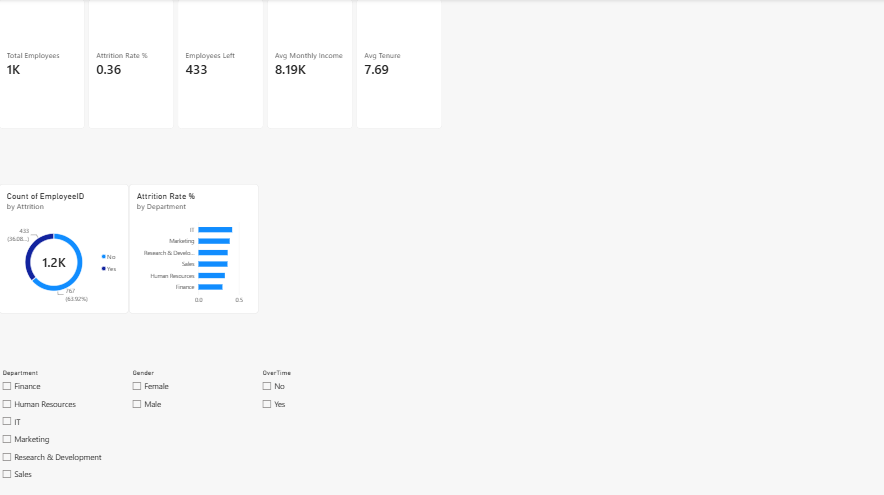
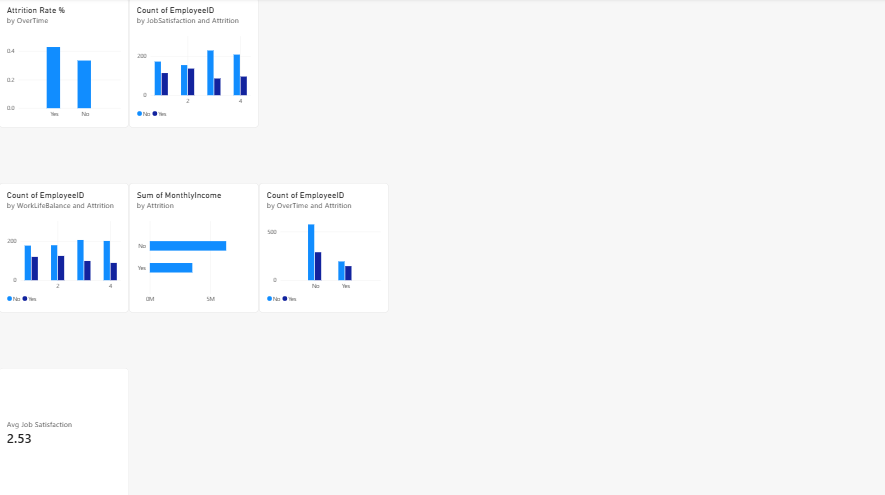
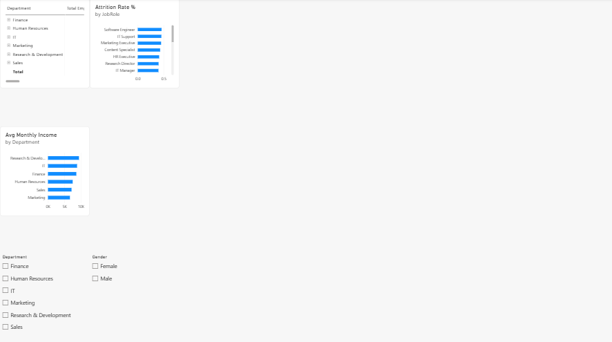
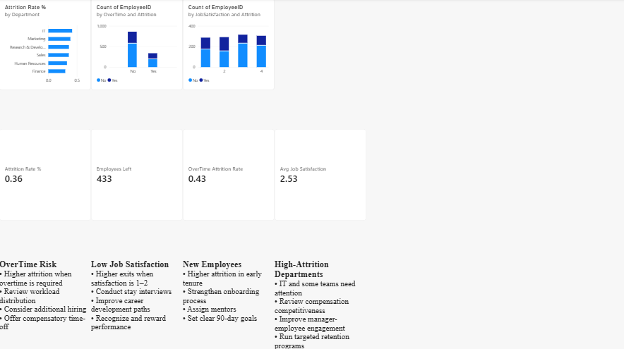

### SQL Analysis
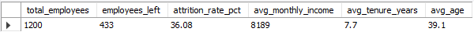
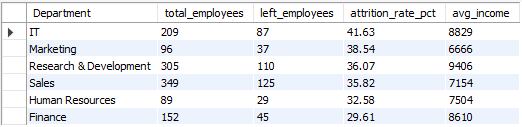
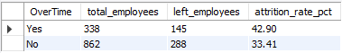
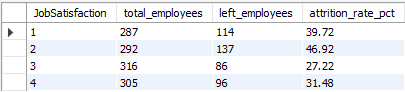
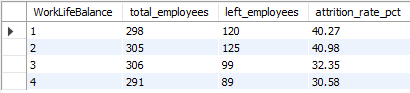
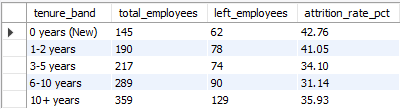

### Python Visualizations
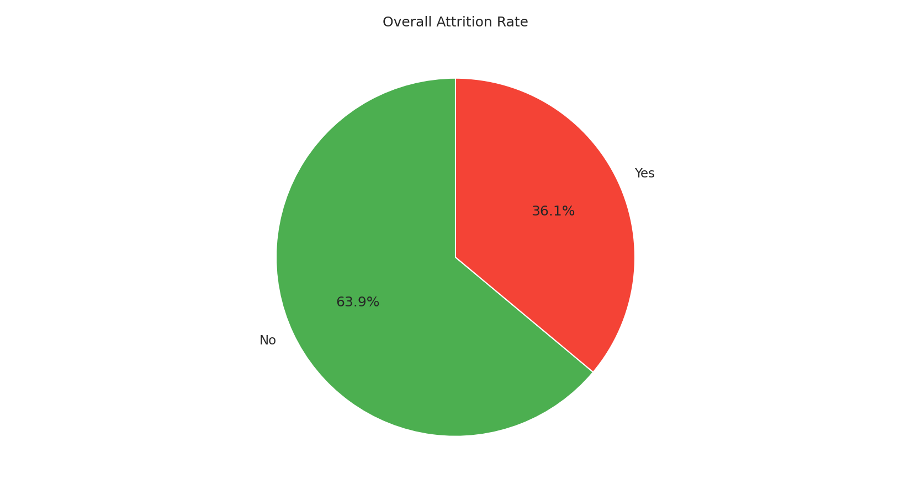
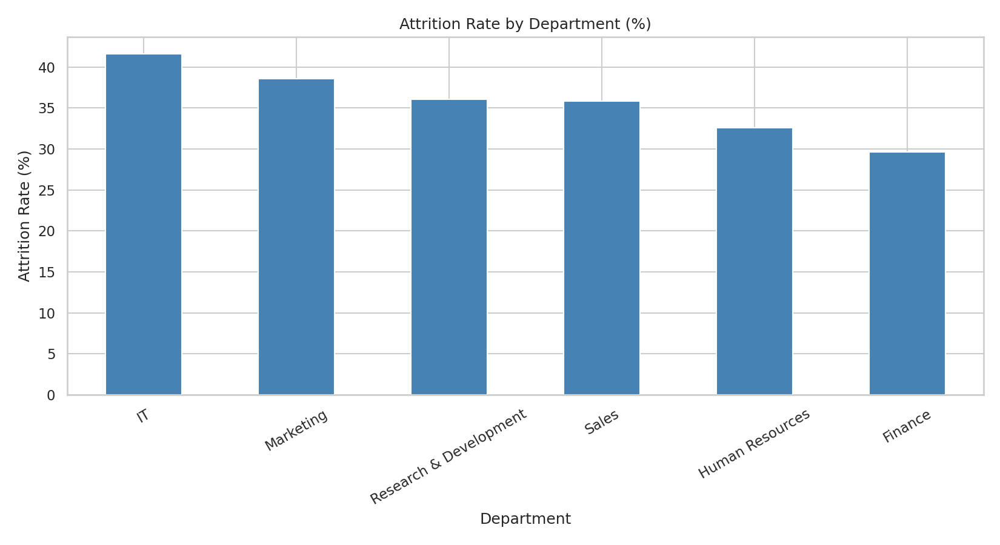
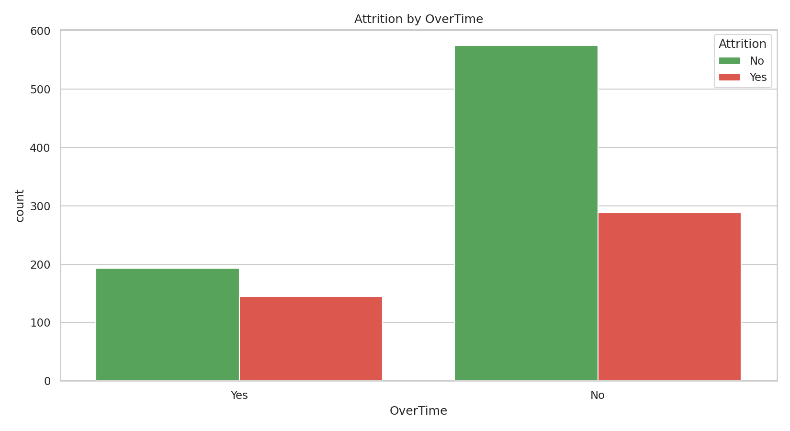
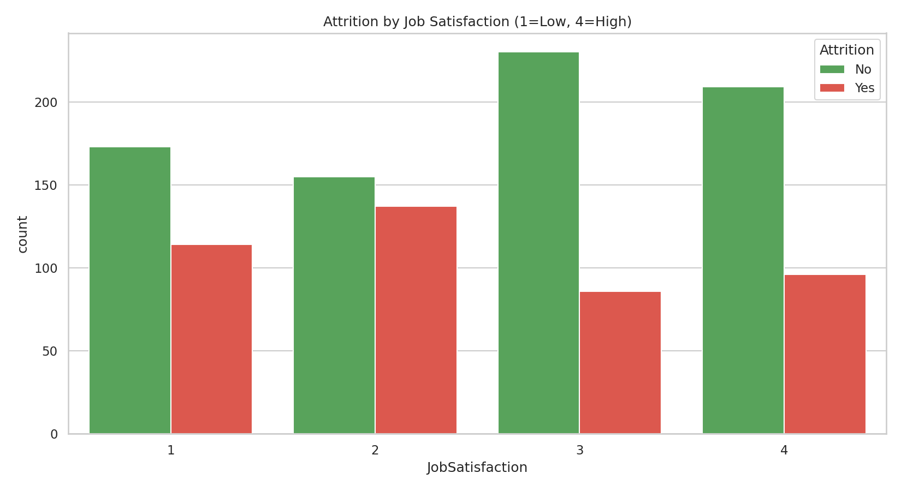
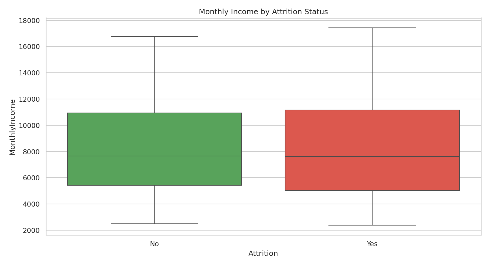
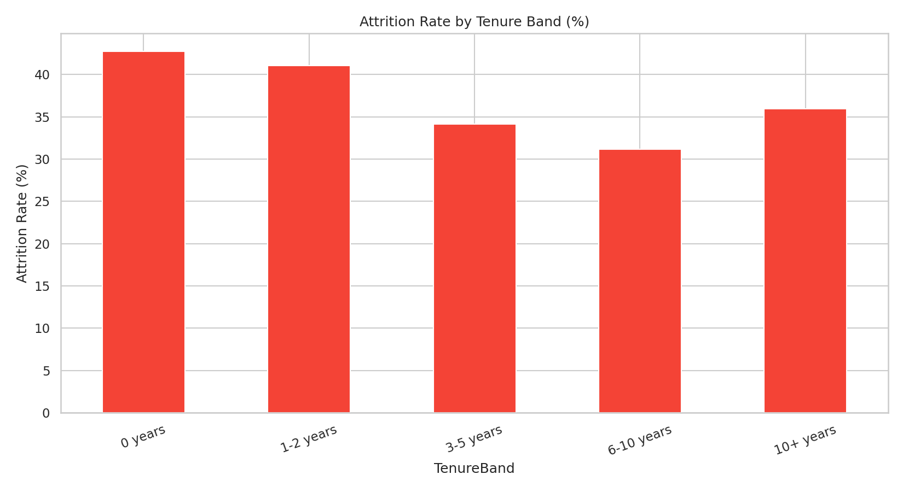

---

## 👤 Author

**Mubeen Salman**  
Aspiring Data Analyst  

- LinkedIn: [https://www.linkedin.com/in/mubeen-salman-459776364/]  
- GitHub: [https://github.com/MuhammadMubeen04]  

---

## 📄 License

This project is for educational and portfolio purposes.
